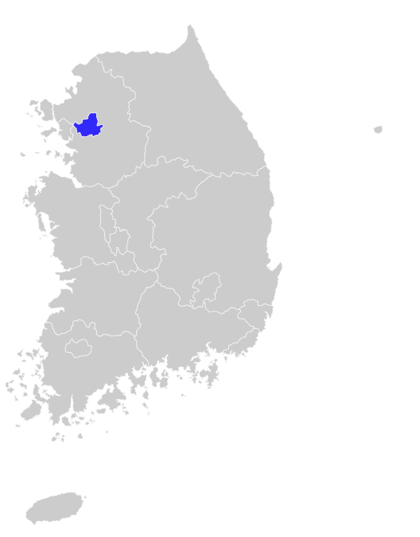
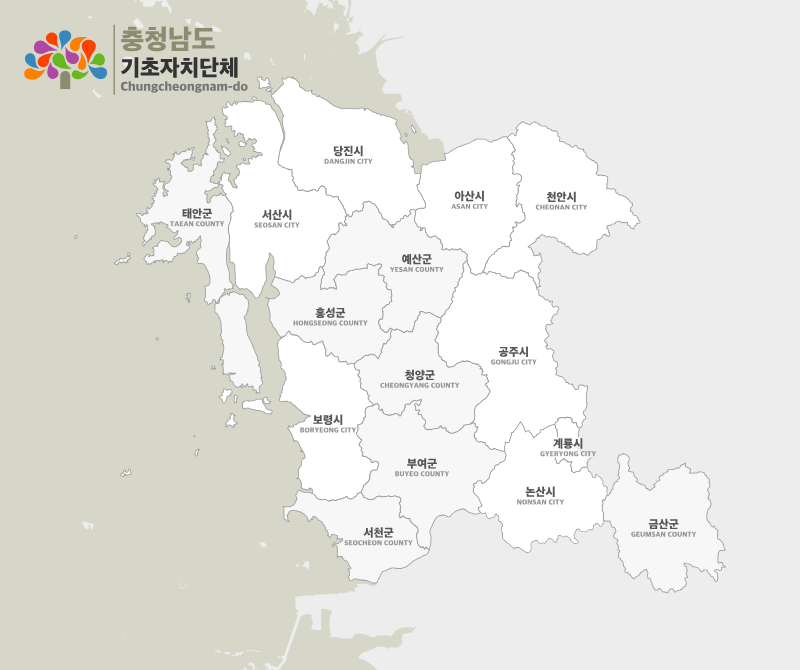

## tour_korea

> 한국의 여러 관광지들을 지도에 표시하여 한눈에 볼수 있게 해주는 어플리케이션

## 📌 Tech Stack

- Next.js (with TS)
- Zustand
- React Query
- [한국 관광공사 Open api](https://www.data.go.kr/data/15101578/openapi.do#/)

## 📌 Feature

### 지도를 사용한 관광지 위치 표시

- 최초 어플리케이션 진입시 대한민국 전체 지도 표시
  

- 특정 지역 클릭시 해당 지역의 상세 지도 표시 및 해당 지역 관광지 리스트업
  

  - 관광지 리스트 클릭시 해당 관광지의 위치를 표시.
    - 관광지 리스트 구성
      - 이름
      - 사진
      - 전화번호
      - 주소

-
